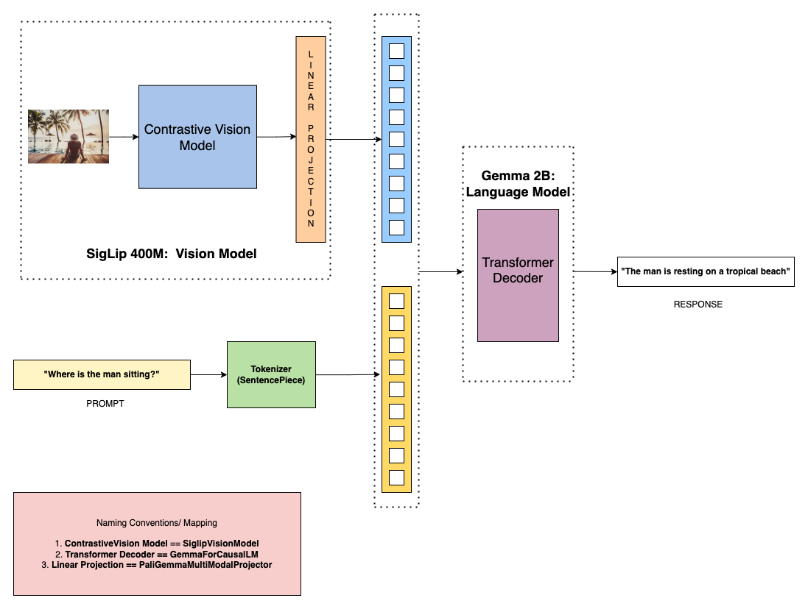

# Paligemma-MultiModal-System
Paligemma Multi-Modal System: A Comprehensive implementation from Scratch, Emulating Multi-Modal Architectures for Future Inference and Deployment

### The overall Multi-Modal Architecture [Abstraction]

### Block-Subblock Dependency View [Concrete]

